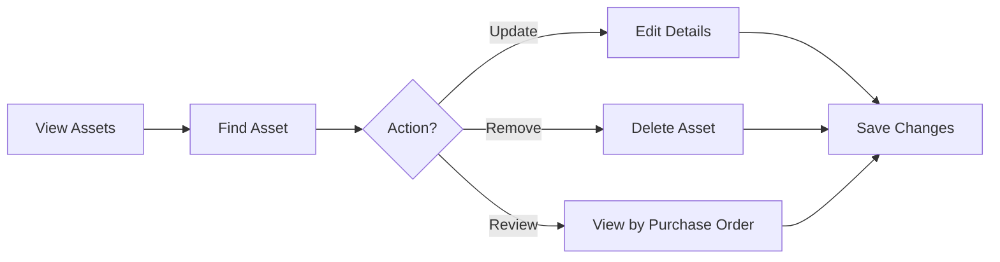

## Overview

This guide will walk you through using the Asset Management System for the first time. You'll learn how to log in, create a supplier, add your first asset, and view your inventory.

<Info>
  This quickstart assumes you have already completed the [Installation Guide](/installation) and the application is running.
</Info>

## Prerequisites

Before starting, ensure:

- Application is deployed and accessible at `http://localhost:8080/LP2_Proyecto_BIENES/`
- MySQL database is running with tables created
- Default admin user exists (username: `admin`, password: `admin123`)

## Getting Started

<Steps>
  <Step title="Access the Application">
    Open your web browser and navigate to the application:
    
    ```
    http://localhost:8080/LP2_Proyecto_BIENES/login.jsp
    ```
    
    You should see the login page with the "Bienvenido" (Welcome) message.
    
    <Tip>
      Bookmark this URL for easy access. The application works best on desktop browsers with a minimum resolution of 1024x768.
    </Tip>
  </Step>
  
  <Step title="Log In to the System">
    Enter your credentials on the login page:
    
    - **ID Usuario**: `admin`
    - **Contraseña**: `admin123`
    
    Click **"Iniciar Sesión"** to log in.
    
    
    
    **What happens next:**
    - The system validates your credentials using `ServletLogin`
    - Your user menu is loaded from the database
    - You're redirected to the main dashboard (`index.jsp`)
    
    <Warning>
      If you see "Usuario y/o clave incorrectos", verify that the default admin user was created during database setup.
    </Warning>
  </Step>
  
  <Step title="Explore the Dashboard">
    After successful login, you'll see the main dashboard with:
    
    - **Navigation sidebar** (left side) - Collapsible menu with system modules
    - **Welcome message** - "Hola, Bienvenido" greeting
    - **Menu options**:
      - Bienes (Assets)
      - Proveedores (Suppliers)
      - Guías y Compras (Purchase Orders)
      - SUNARP (Registration)
      - Operadores (Operators)
    
    **Navigation Tips:**
    - Click the **chevron icon** (▶) to expand/collapse the sidebar
    - Hover over menu items to see full names
    - Click **"Cerrar Sesión"** at the bottom to log out
    
    <Note>
      The menu items displayed are dynamically loaded based on your user permissions, making the system role-aware.
    </Note>
  </Step>
  
  <Step title="Create Your First Supplier">
    Before adding assets, you need to create at least one supplier.
    
    1. **Navigate to Suppliers**:
       - Click **"Proveedores"** in the sidebar
       - You'll see the "Listado de Proveedores" (Supplier List) page
    
    2. **Open the Registration Form**:
       - Click the **"Nuevo Proveedor"** button
       - A modal dialog appears with the supplier form
    
    3. **Fill in Supplier Information**:
       ```
       Nombre Proveedor: Tech Supply Co.
       Distrito: Lima
       Teléfono: 987654321
       Estado: ACTIVO
       ```
    
    4. **Save the Supplier**:
       - Click **"Grabar"** (Save)
       - The form validates your input:
         - Name: 4-20 letters only
         - District: 4-20 letters only
         - Status: 4-20 letters only
       - On success, you'll see a confirmation message
       - The supplier appears in the data table
    
    **Form Validation Rules:**
    - All fields are required
    - Text fields accept letters and spaces only
    - Length constraints: MIN 4, MAX 20 characters
    
    <Tip>
      The DataTable interface allows you to search, sort, and filter suppliers. Use the search box above the table to quickly find suppliers.
    </Tip>
  </Step>
  
  <Step title="Add Your First Asset">
    Now you're ready to track your first asset!
    
    1. **Navigate to Assets**:
       - Click **"Bienes"** in the sidebar
       - You'll see the "Listado de Bienes" (Assets List) page
    
    2. **Open the Registration Form**:
       - Click the **"Registrar"** button
       - The "BIENES" modal dialog appears
    
    3. **Enter Asset Details**:
       ```
       Código: 0 (auto-generated, read-only)
       Descripcion: Laptop Dell XPS 15
       Cantidad: 5
       Nombre Proveedor: Tech Supply Co.
       Fecha Llegada: 2026-03-04
       Codigo Compra: 1
       ```
    
    4. **Understanding the Fields**:
       - **Código**: Auto-generated asset code (primary key)
       - **Descripción**: Asset description (4-20 characters, letters only)
       - **Cantidad**: Quantity (positive integer)
       - **Nombre Proveedor**: Supplier name (must match existing supplier)
       - **Fecha Llegada**: Arrival date (format: YYYY-MM-DD)
       - **Codigo Compra**: Purchase order reference number
    
    5. **Save the Asset**:
       - Click **"Grabar"** (Save)
       - Form validation ensures data quality:
         - Description: Letters only, 4-20 chars
         - Quantity: Positive integers only
         - Date: Must be in YYYY-MM-DD format
       - The asset is saved to the database via `ServletBienes`
       - Success message appears and asset shows in the table
    
    **Behind the Scenes:**
    ```java
    // ServletBienes processes the request
    ServletBienes?tipo=REGISTRAR
    
    // Creates a Bienes object
    Bienes bean = new Bienes();
    bean.setDescrip_bien("Laptop Dell XPS 15");
    bean.setCantidad_bien(5);
    bean.setNom_provee("Tech Supply Co.");
    bean.setFecha_llegada(java.sql.Date.valueOf("2026-03-04"));
    bean.setCodigoOrdendeCompra(1);
    
    // Saves via DAO layer
    MySqlBienesDAO.save(bean);
    ```
  </Step>
  
  <Step title="View Your Inventory">
    Your asset is now tracked in the system!
    
    **Viewing Options:**
    
    1. **Assets Table**:
       - All assets display in a sortable, searchable DataTable
       - Columns: Código, Descripción, Cantidad, Proveedor, Fecha Llegada, Codigo Compra
       - Click column headers to sort
       - Use the search box to filter results
    
    2. **Edit an Asset**:
       - Click the **"Editar"** (Edit) button on any row
       - The form pre-fills with current data (fetched via `ServletBienesJSON`)
       - Modify values and click **"Grabar"**
       - Backend processes via `ServletBienes?tipo=ACTUALIZAR`
    
    3. **Delete an Asset**:
       - Click the **"Eliminar"** (Delete) button
       - Confirm deletion in the modal: "¿Seguro de eliminar?"
       - Click **"SI"** to permanently remove
       - Processes via `ServletBienes?tipo=ELIMINAR`
    
    <Warning>
      Deletion is permanent and cannot be undone. Always verify before deleting assets.
    </Warning>
  </Step>
  
  <Step title="Create a Purchase Order (Optional)">
    Track purchases with formal documentation.
    
    1. **Navigate to Purchase Orders**:
       - Click **"Guías y Compras"** in the sidebar
    
    2. **Create New Order**:
       ```
       Nombre Proveedor: Tech Supply Co.
       Fecha Compra: 2026-03-01
       Descripcion: Laptops and Accessories
       Cantidad: 5 units
       Precio: 15000.00
       ```
    
    3. **Link to Assets**:
       - Use the purchase order code when creating assets
       - This creates a traceable relationship between orders and received items
    
    **Query Assets by Purchase Order:**
    
    The system allows filtering assets by purchase order:
    ```java
    // Via MySqlBienesDAO.java
    List<Bienes> assets = dao.listarBienesporCodigodeComptra(orderCode);
    ```
  </Step>
  
  <Step title="Register an Operator (Optional)">
    Track who handles and manages assets.
    
    1. **Navigate to Operators**:
       - Click **"Operadores"** in the sidebar
    
    2. **Add New Operator**:
       - Click **"Nuevo Operador"**
       - Fill in operator details:
         ```
         Nombre: Juan Pérez
         Distrito: Lima
         Celular: 999888777
         Estado: ACTIVO
         ```
    
    3. **Use Case**:
       - Track which operators are responsible for specific asset categories
       - Maintain contact information for asset handling personnel
       - Monitor operator status and assignments
  </Step>
</Steps>

## Common Workflows

### Workflow 1: Complete Asset Acquisition Process

<Steps>
  <Step title="Register Supplier">
    Create supplier record before any purchases
  </Step>
  
  <Step title="Create Purchase Order">
    Document the purchase agreement
  </Step>
  
  <Step title="Record Asset Arrival">
    Add assets when they arrive, linking to purchase order
  </Step>
  
  <Step title="Register with SUNARP">
    For assets requiring legal registration, create SUNARP entry
  </Step>
</Steps>

### Workflow 2: Asset Tracking and Updates



## Key Features Deep Dive

### DataTables Interface

All list views use jQuery DataTables for enhanced functionality:

- **Search**: Real-time filtering across all columns
- **Sorting**: Click any column header to sort
- **Pagination**: Navigate large datasets efficiently
- **Responsive**: Adapts to different screen sizes

```javascript
// DataTables initialization in JSP pages
$(document).ready(function() {
    $('#example').DataTable();
});
```

### AJAX Updates

Editing uses AJAX for seamless user experience:

```javascript
// When clicking Edit button
$(document).on("click", ".btn-success", function() {
    let cod = $(this).parents("tr").find("td")[0].innerHTML;
    
    // Fetch current data via JSON servlet
    $.get("ServletBienesJSON?codigo=" + cod, function(response) {
        // Pre-fill form with current values
        $("#idCodigo").val(response.codigo_bien);
        $("#idDescripcion").val(response.descrip_bien);
        $("#idCantidad").val(response.cantidad_bien);
        // ... more fields
    });
});
```

### Form Validation

Bootstrap Validator ensures data quality:

```javascript
$('#idRegistrar').bootstrapValidator({
    fields: {
        descripcion: {
            validators: {
                notEmpty: {
                    message: 'Campo descripción es obligatorio'
                },
                regexp: {
                    regexp: /^[a-zA-ZñÑ\s]{4,20}$/,
                    message: 'Solo letras MIN:4 - MAX:20'
                }
            }
        }
        // ... more field validations
    }
});
```

## Tips and Best Practices

<CardGroup cols={2}>
  <Card title="Data Entry" icon="keyboard">
    **Best Practices:**
    - Use consistent naming conventions for suppliers
    - Enter dates in YYYY-MM-DD format
    - Keep descriptions concise but descriptive
    - Always verify data before saving
  </Card>
  
  <Card title="Organization" icon="folder">
    **Recommendations:**
    - Create all suppliers before adding assets
    - Use meaningful purchase order codes
    - Keep supplier information up-to-date
    - Regularly review and clean inactive records
  </Card>
  
  <Card title="Navigation" icon="compass">
    **Efficiency Tips:**
    - Collapse sidebar for more screen space
    - Use browser back button or sidebar navigation
    - Bookmark frequently used pages
    - Keep multiple browser tabs for different modules
  </Card>
  
  <Card title="Data Management" icon="database">
    **Maintenance:**
    - Regularly backup the database
    - Monitor disk space usage
    - Archive old purchase orders
    - Review and update operator assignments
  </Card>
</CardGroup>

## Troubleshooting Common Issues

<Accordion title="Can't Create Asset - Validation Errors">
**Problem**: Form won't submit due to validation errors

**Solutions**:
1. **Description field**: Only letters and spaces, 4-20 characters
2. **Quantity field**: Must be a positive integer
3. **Date field**: Use YYYY-MM-DD format (e.g., 2026-03-04)
4. **Supplier name**: Must match an existing supplier exactly
5. Check all fields have red borders - these need correction

**Example Valid Entry**:
```
Descripcion: Laptop HP        ✓
Cantidad: 10                  ✓
Fecha Llegada: 2026-03-04     ✓
```
</Accordion>

<Accordion title="Asset List Shows Empty">
**Problem**: No assets appear in the table after creating them

**Solutions**:
1. Check if save was successful (look for success message)
2. Refresh the page: `ServletBienes?tipo=LISTAR`
3. Check browser console for JavaScript errors (F12 → Console)
4. Verify database contains the record: `SELECT * FROM bienes;`
5. Clear browser cache and reload
</Accordion>

<Accordion title="Edit Button Doesn't Load Data">
**Problem**: Clicking "Editar" doesn't populate the form

**Solutions**:
1. Check browser console for AJAX errors
2. Verify `ServletBienesJSON` is responding:
   - Visit: `http://localhost:8080/LP2_Proyecto_BIENES/ServletBienesJSON?codigo=1`
   - Should return JSON data
3. Ensure jQuery is loaded (check page source)
4. Test with different browser or clear cache
</Accordion>

<Accordion title="Session Timeout / Automatic Logout">
**Problem**: Redirected to login page unexpectedly

**Explanation**: Session timeout after period of inactivity

**Solutions**:
1. Log in again with your credentials
2. Work is saved - navigate back to where you were
3. Configure longer session timeout in `web.xml` if needed:
```xml
<session-config>
    <session-timeout>60</session-timeout> <!-- minutes -->
</session-config>
```
</Accordion>

## Understanding the Code Structure

### Request Flow for Creating an Asset

```java
// 1. User submits form
Bienes.jsp → <form action="ServletBienes?tipo=REGISTRAR">

// 2. ServletBienes receives request
public class ServletBienes extends HttpServlet {
    protected void service(HttpServletRequest request, ...) {
        String tipo = request.getParameter("tipo");
        if (tipo.equals("REGISTRAR")) {
            registrar(request, response);
        }
    }
}

// 3. Service layer processes
BienesServices service = new BienesServices();
int result = service.save(bean);

// 4. DAO layer saves to database
public int save(Bienes bean) {
    Connection cn = MySqlConexion.getConectar();
    String sql = "INSERT INTO bienes VALUES(null,?,?,?,?,?)";
    PreparedStatement pstm = cn.prepareStatement(sql);
    pstm.setString(1, bean.getDescrip_bien());
    // ... set other parameters
    return pstm.executeUpdate();
}

// 5. Response to user
request.setAttribute("MENSAJE", "Asset registered successfully");
request.getRequestDispatcher("Bienes.jsp").forward(request, response);
```

### Entity Relationships

```
Bienes (Assets)
  ├─ nom_provee → References Proveedor.nom_prove
  └─ codigo_ordencompra → References grr-ordendecompra.codigo

InscripcionSUNARP
  └─ nom_provee → References Proveedor.nom_prove

Usuario (Users)
  └─ Menu items dynamically assigned per user
```

## Next Steps

<CardGroup cols={3}>
  <Card title="Advanced Features" icon="graduation-cap">
    Explore SUNARP registration, purchase order management, and operator assignments
  </Card>
  
  <Card title="System Administration" icon="gear">
    Learn about user management, database maintenance, and backup strategies
  </Card>
  
  <Card title="Integration" icon="plug">
    Connect with other systems or export data for reporting
  </Card>
</CardGroup>

## Quick Reference

### Default Credentials
```
Username: admin
Password: admin123
```

### Key URLs
```
Login:      /login.jsp
Dashboard:  /index.jsp
Assets:     /ServletBienes?tipo=LISTAR
Suppliers:  /ServletProveedor?tipo=LISTAR
Orders:     /ServletGuia?tipo=LISTAR
SUNARP:     /ServletSunarp?tipo=LISTAR
Operators:  /ServletOperador?tipo=LISTAR
```

### Servlet Actions
```
tipo=LISTAR    - List all records
tipo=REGISTRAR - Create new record
tipo=ACTUALIZAR - Update existing record
tipo=ELIMINAR  - Delete record
```

<Tip>
  You've completed the quickstart! You now know how to log in, create suppliers, add assets, and manage your inventory. Explore the other modules to leverage the full power of the Asset Management System.
</Tip>

## Resources

- [Installation Guide](/installation) - Complete setup instructions
- [Introduction](/introduction) - System overview and features
- Database Schema - Reference the installation guide for complete DDL
- Source Code - Located at `~/workspace/source/src/main/java/com/bienes/`

<Note>
  For production deployment, remember to change default passwords, enable HTTPS, and implement proper backup procedures as outlined in the [Installation Guide](/installation).
</Note>